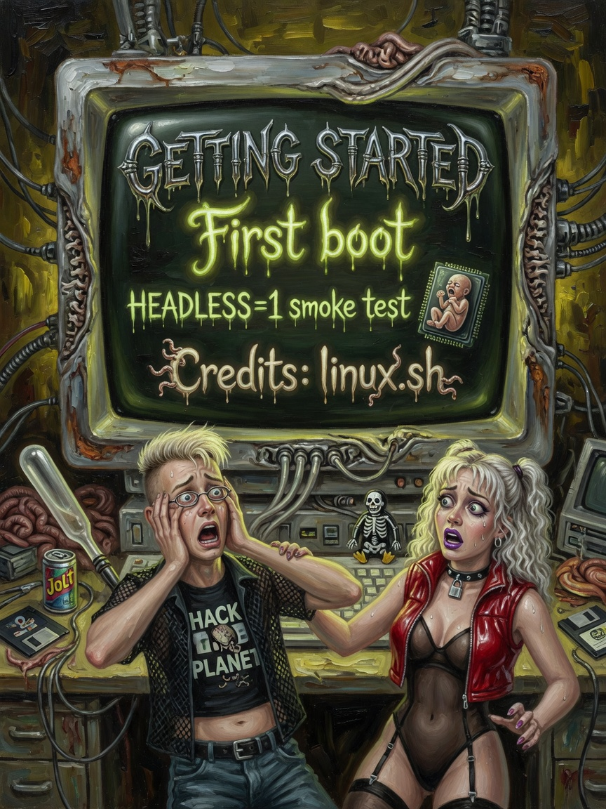

# Getting Started — Issues 31–33

> *In memoriam: **The Golden Era** — MS-DOS 6.x, QBASIC, and everyone who kept a 486 alive long enough to see Vulkan.*

<p align="center">
  
  
  
</p>

| Cover | Issue | Cast | Packs |
|-------|-------|------|-------|
| First boot | **31** | Ammo · `./linux.sh` | clone · run · splash |
| Scared newbie | **32** | First-build panic | deps · black screen |
| Headless cheer | **33** | Captain Ellie | CI · grep · exit codes |

---

## The Legend

Issue 31 is the recruitment cover — Ammo pointing at the ritual like it is a magazine exclusive. Issue 32 honors every developer who ever stared at a black window and whispered "did I forget SDL3." Issue 33 is Ellie at 2 AM running `HEADLESS=1 AMOURANTHRTX_MAX_FRAMES=120` because **cute does not mean helpless**.

*The Tide Temple begins with `./linux.sh`. Not with a pitch deck.*

---

## The Interview

Next Generation honest start — no fake one-click magic. Linux. Vulkan 1.4+ GPU. C++23. SDL3 via `linux.sh`. That is the church.

```bash
git clone https://github.com/ZacharyGeurts/AMOURANTHRTX
cd AMOURANTHRTX
chmod +x linux.sh
./linux.sh
./linux.sh run
```

**First run:** `aos_load` splash → taskbar/wallpaper → Captain status block every ~5 s. ELLIE categories light up: FPS, GPU ms, VRAM, thermo. Sexy desktop proof. Sober numbers.

**Keys:** F1 adaptive · F7 camera reset · F10 die reset · canvas swipe for shader family. Missing DOS image: `./linux.sh dos`.

Headless CI — Ellie cover Issue 33:
```bash
AMOURANTHRTX_HEADLESS=1 AMOURANTHRTX_MAX_FRAMES=60 ./build/bin/Linux/AMOURANTHRTX
```

| Env | Effect |
|-----|--------|
| `HEADLESS=1` | No window |
| `MAX_FRAMES=N` | Bounded exit |
| `SKIP_HOTSWAP=1` | Skip background x86 compile |
| `FIELD_DEBUG=1` | Field HUD |
| `RTX_PROBES=1` | RTX probe buffer |

Console: `level puny|adept|tidewalker`.

---

## Beginner

**Needs:** Linux, Vulkan 1.4+ GPU, C++23, SDL3 (via `linux.sh`).

Clone, build, run — commands above. First grin when `C:\>` or desktop answers.

---

## Intermediate

Headless pattern and env table above. Read logs from terminal; do not trust the painting's OCR.

---

## Expert

Boot: `boot_x86_canvas()` loads `aos_load`, queues hotswap to `x86`, sets `ProgramsCanvasReady` when Vk pipeline live.

`sync_x86_compile_active` vs `hotswap_compile_active` split boot splash from background compile.

Read next: Field Die → Data Bus → Field Fabric.

---

**Next:** [12-Glossary.md](12-Glossary.md)

**AMOURANTH FOREVER** — branding loud; physics with units.