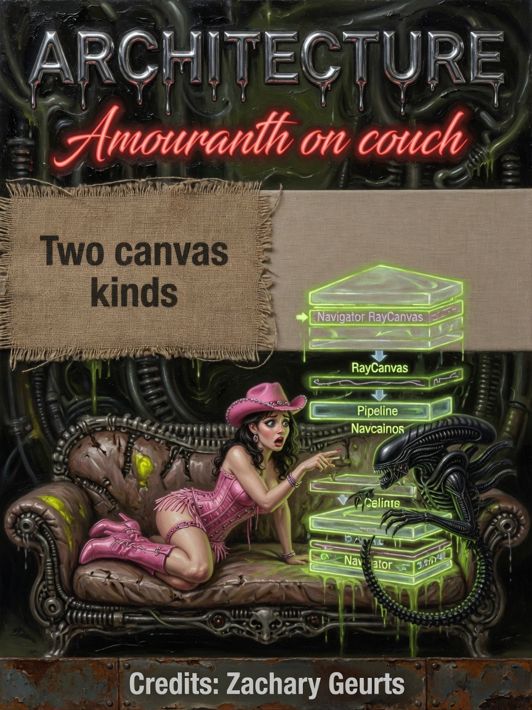
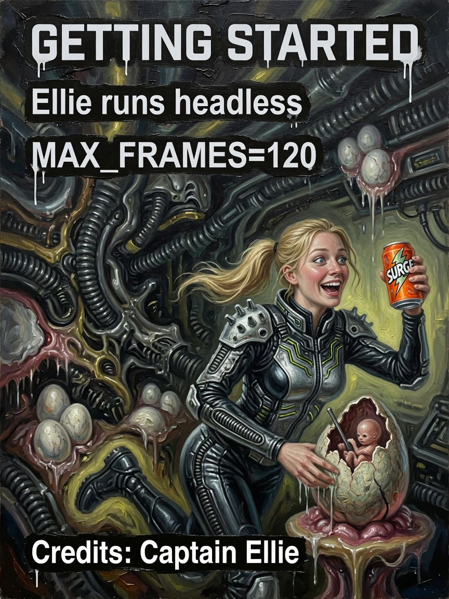

# Architecture — Issues 37–39

> *In memoriam: **Khronos** — the API throne behind every `rtx()` dispatch we pretend is casual.*

<p align="center">
  
  
  
</p>

| Cover | Issue | Cast | Packs |
|-------|-------|------|-------|
| Blueprint | **37** | Professors | host → Navigator → Pipeline |
| Layer couch | **38** | Ammo · magazine pose | RayCanvas · dispatch |
| rtx() scared | **39** | Pipeline nerd | Classic TLAS vs x86 compute |

---

## The Legend

Issue 37 is the sober blueprint — small host, fat GPU field computer, professors who read headers for fun. Issue 38 is Ammo on the couch of layers: sexy-tame proof that **glamour and dispatch graphs coexist**. Issue 39 is the nerd who just learned hybrid RT and x86 compute share a heartbeat — scared face, honest stack.

*The brain does not simulate the universe. Rosa steers. The die and fabric do the sweating.*

---

## The Interview

Architecture in AMOURANTHRTX is deliberately **lopsided** — and that is the feature. `main.cpp` breaks a sweat opening SDL3. Almost everything interesting happens in `Pipeline::dispatch_canvas` and whichever `.comp` is live.

Per frame, simplified gospel:

```
input → pack FieldSocket or PushConstants
      → FieldLayer::pumpAll (DOS subsystems tick)
      → thermo accountant fill
      → dispatch active canvas
      → present
```

`rtx()` holds Vulkan, TLAS on classic path, `GPUFabric`, sealed `TotalTime`. Hybrid HW RT + RTXGI: classic only (F2/F3). **x86 is compute field console** — different layout, same fabric images bound 8–10.

Ammo on Issue 38 is not decoration. She is proof one binary holds premium stylized chrome **and** a field die. Ellie watches ELLIE categories through the whole stack.

---

## Beginner

Small host, fat GPU:

`main.cpp` → `Navigator` → `RayCanvas` + `Pipeline` + `FieldLayer` + emulators.

Almost everything interesting happens in `Pipeline::dispatch_canvas` and the active `.comp`.

---

## Intermediate

Per-frame: input → pack FieldSocket or PushConstants → `FieldLayer::pumpAll` → thermo fill → dispatch → present.

`rtx()` holds Vulkan, TLAS (classic), `GPUFabric`, sealed `TotalTime`.

Hybrid HW RT + RTXGI: classic path only (F2/F3). x86 is compute field console.

---

## Expert

**Classic bindings:** HDR 0–1, accountant 2, materials 4, audio 6, TLAS 7, fabric 8–10.

**Field bindings:** image 0, die SSBO 1, accountant 2, fabric 8–10, chrome 11–14.

`updateHardwareFromAnalogFields()` drives `rtx().hardwareFabric` from fabric aggregates.

---

**Next:** [04-Field-Die.md](04-Field-Die.md) · [Brain & Bus](../info/BRAIN-AND-BUS.md)

**AMOURANTH FOREVER** — branding loud; physics with units.