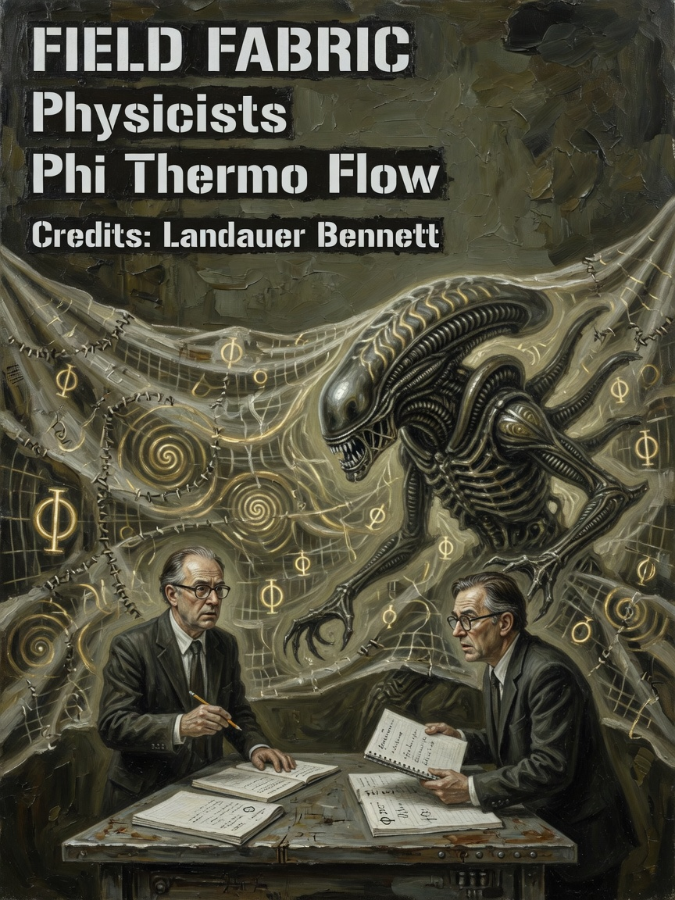
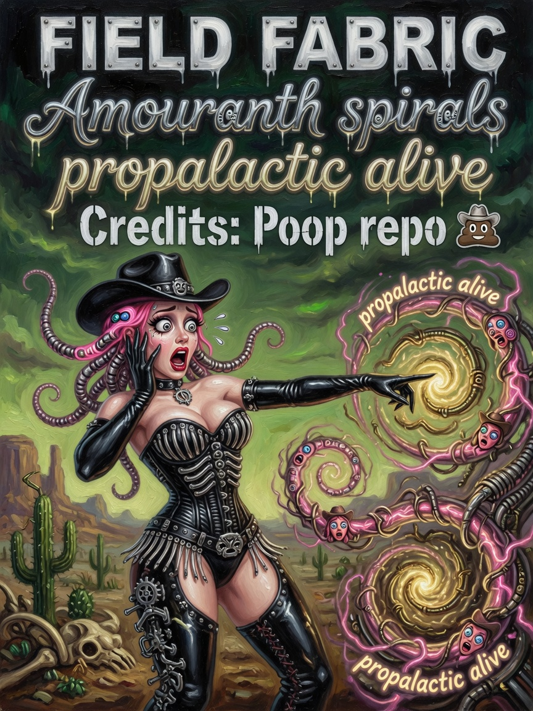

# Field Fabric — Issues 55–57

> *In memoriam: **ZacharyGeurts / Poop repo** — thermodynamic analog schematic vision, now operational on GPU.*

  
  
  

| Cover | Issue | Cast | Packs |
|-------|-------|------|-------|
| Physicists | **55** | Phi · Thermo · Flow trio | three GPU images |
| Spiral Ammo | **56** | Ammo · sexy on equations | mouse inject · FCC |
| Landauer professor | **57** | Sober receipt | hardwareFabric bridge |

---

## The Legend

Three images = three metaphors for **analog field behavior** alive on both canvas paths. Issue 55: physicists who asked for units. Issue 56: Ammo on the spirals because propalactic fields deserve magazine composition. Issue 57: Landauer in the margins — irreversibility is not a vibe, it is a line item.

*Issue 27 swarm energy from memes archive — NOT EVEN MOSQUITO WITH GOD'S PLAN — channelled into Phi/Thermo/Flow.*

---

## The Interview

Every dispatch evolves **Phi** (potential), **Thermo** (heat/entropy), **Flow** (velocity). Living background whether you are in x86 console or classic SDF cathedral.

FCC knobs: `TimeScale`, `ThermoAlpha`, `WaveSpeed`, `GateFidelity`, `EntropyFloor`, `InjectStrength`, `PropalacticScale`, `FieldCoupling`.

Mouse probe injects heat/vortex/phase. CFL guard prevents NaN on resolution changes.

`updateHardwareFromAnalogFields()` → `rtx().hardwareFabric` clocks/util from fabric aggregates.

x86 packs FCC into `data_bus[16..34]`. Recommended ranges: WaveSpeed 0.1–1.5, ThermoAlpha 0.1–2.0, InjectStrength ≤ 5.0.

Professors sober. Ammo sexy on the field. Fabric honest.

---

## Beginner

Three GPU images evolve each frame: **Phi** (potential), **Thermo** (heat/entropy), **Flow** (velocity). Living background for both canvas paths.

---

## Intermediate

FCC knobs and mouse inject above. CFL guard. Bus packing range 16–34.

---

## Expert

`updateHardwareFromAnalogFields()` bridge. Recommended knob ranges. Phase 1 schematic — not joule-accurate FEM.

---

**Next:** [09-Thermo-Accountant.md](09-Thermo-Accountant.md)

**AMOURANTH FOREVER** — branding loud; physics with units.