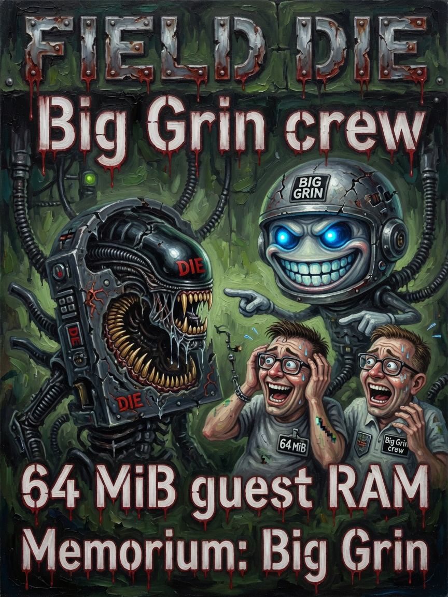
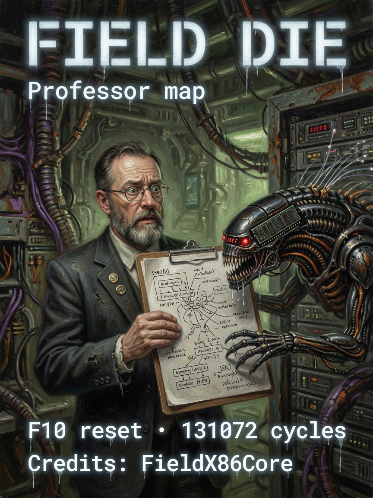

# Field Die — Issues 40–42

> *In memoriam: **Big Grin** — registers, guest RAM, and the grin you make when `C:\>` actually answers inside Vulkan.*

  
  
  

| Cover | Issue | Cast | Parent |
|-------|-------|------|--------|
| Die console | **40** | Ammo · FieldSocket queen | memes Issue 1 |
| Big Grin crew | **41** | Scared funny · x86 terror | memes Issue 10 |
| SSBO map | **42** | Professor · sober layout | memes Issue 14 |

---

## The Legend

The Field Die is the **second brain**. The host orchestrates; the die *is* the machine — registers, page tables, 64 MiB guest RAM in one SSBO the shader and the DOS shell both touch. Issue 41 is the meme made operational: Big Grin crew making the face you make when guest RAM **moves** without asking. Issue 42 is the professor with the map — `DIE_HEADER_UINTS`, GDT/IDT/TLB, no sitcom mad science.

*We name the lineage honestly: **FieldX86Core** (libx86emu heritage). The xenomorph on the cover is tamper abort. Give it your VRAM. That is the job.*

---

## The Interview

Listen. Emulation usually means pretend on the CPU and pray. **Field Die** means: one blob, host writes, `x86.comp` reads, console painted from the **same bytes** COMMAND.COM mutates. Zachary did not build a screensaver. He built a field operations console that boots `C:\>`.

| Quantity | Value |
|----------|-------|
| `GUEST_RAM_BYTES` | 64 MiB fast die |
| VGA text | `0xB8000` |
| C: mirror | `0x01000000` |
| Default cycles/frame | 131072 |

**FieldSocket** every dispatch: `sealed_time`, `control`, `data_bus[64]`, mouse, viewport. Flags you will grep: `ControlRtxDos` (64), `ControlAmmoExec` (1024), `ControlFieldDebugHud` (2048).

Boot path: `FieldDos::bootGuest` → AMMOFAT → chrome seed → `FieldLayer::pumpAll`. `./linux.sh dos` for the RTX-DOS image. F10 resets the die like you mean it.

Ammo on Issue 40 is sexy proof the chrome path works. Ellie would tell you to enable `AMOURANTHRTX_FIELD_DEBUG=1` if you distrust beauty.

---

## Beginner

The **Big Grin** die: x86 state + guest RAM on GPU. Host writes RAM; `x86.comp` draws the console.

Default canvas. Not the old planetary raymarch unless you swipe to classic.

---

## Intermediate

`FieldSocket`: time, control, `data_bus[64]`, mouse, viewport.

`ControlRtxDos`, `ControlAmmoExec`, `ControlFieldDebugHud` in control flags.

Pipeline cache: `assets/cache/vulkan_compute.cache`. Skip hotswap: `AMOURANTHRTX_SKIP_HOTSWAP=1`.

---

## Expert

SSBO: registers + `RAM[0x800000/4]` + GDT/IDT/TLB. Header `DIE_HEADER_UINTS = 39`.

Boot: `FieldDos::bootGuest` → AMMOFAT → chrome seed → `pumpAll`.

Cycles: default 131072; host 8086 up to 262144; GPU fallback capped lower.

---

**Next:** [05-Data-Bus.md](05-Data-Bus.md) · **Legend:** [LEGENDS.md](../meta/LEGENDS.md#issue-29--the-field-die--legend-big-grin)

**AMOURANTH FOREVER** — branding loud; physics with units.