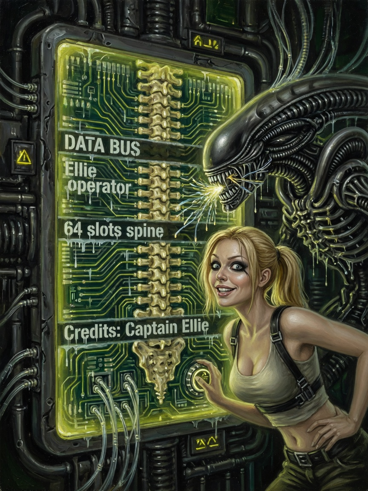
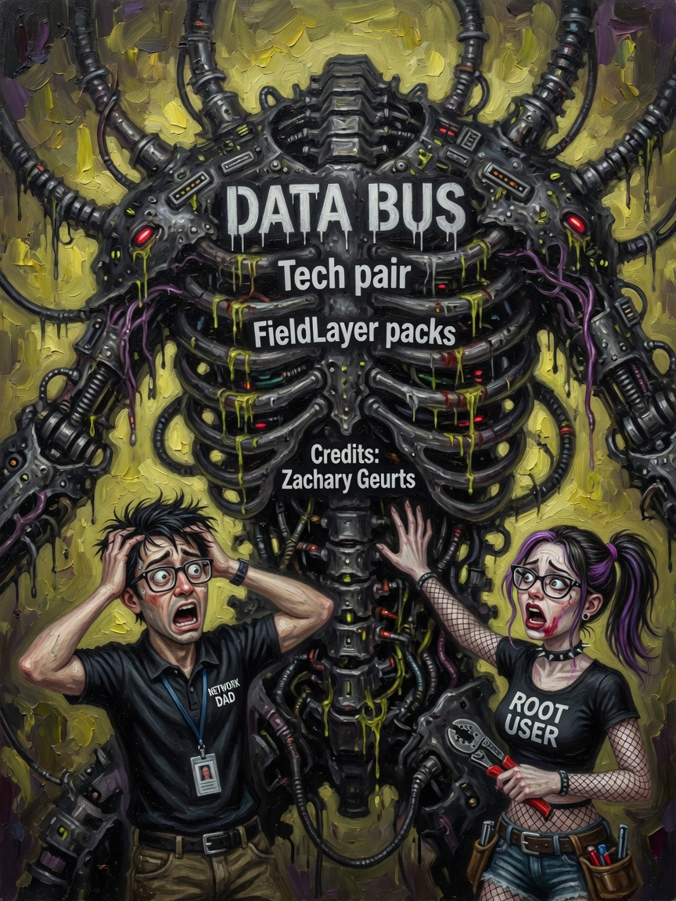

# Data Bus — Issues 43–45

> *In memoriam: **Rosa Parks & the Bus** — the 64-slot nervous system; human telemetry at the wheel.*

<p align="center">
  
  
  
</p>

| Cover | Issue | Cast | Packs |
|-------|-------|------|-------|
| Bus operator | **43** | Captain Ellie | Rosa's nervous system |
| Tech pair | **44** | Gil Kane hardware | slot ranges |
| Telemetry queen | **45** | Ammo | packToDataBus |

---

## The Legend

The **data bus** is how the shader HUD reads the field without autopsying every byte of guest RAM. Issue 43: Ellie operating the wheel — cute, competent, never -1. Issue 44: two techs mapping 64 slots like electricians with dignity. Issue 45: Ammo glamorous on the spine because **telemetry can be magazine-grade**.

*Slot 42 even tells `x86.comp` whether AmouranthOS desktop or console shell is live. That is not lore. That is `FieldLayer.hpp`.*

---

## The Interview

Sixty-four slots. One push per dispatch. Control plane, not DMA fantasy.

| Range | Topic |
|-------|-------|
| 0 | Registry tag |
| 2–7 | RAM / RAID |
| 8–11 | VGA |
| 12–15 | FAT |
| 16–23 | FCC floats |
| 24–28 | Thermo mirror |
| 32–41 | Input |
| 42–56 | Viewport / AmmoOS |

`FieldLayer` hooks: `syncFromGuest`, `tick`, `packToDataBus`. Pump order: guest RAM authoritative → layers publish summaries → bus mirrors → shader tiles.

Ellie grep tip:
```bash
grep -E 'data_bus|STATUS|slot' run.log
```

Ammo on Issue 45 is the queen because the bus is how the **emblem path and the die path shake hands** every frame.

---

## Beginner

64 slots mirror host telemetry into the shader every frame. HUD reads fixed slots — not full RAM scrapes.

---

## Intermediate

Slot table above. `address_bus[16]` for I/O windows.

---

## Expert

`FieldLayer` hooks: `syncFromGuest`, `tick`, `packToDataBus`. Pump order: guest RAM authoritative → layers publish summaries.

Treat bus as control plane, not DMA.

---

**Next:** [06-AmmoOS.md](06-AmmoOS.md) · [Brain & Bus](../info/BRAIN-AND-BUS.md)

**AMOURANTH FOREVER** — branding loud; physics with units.