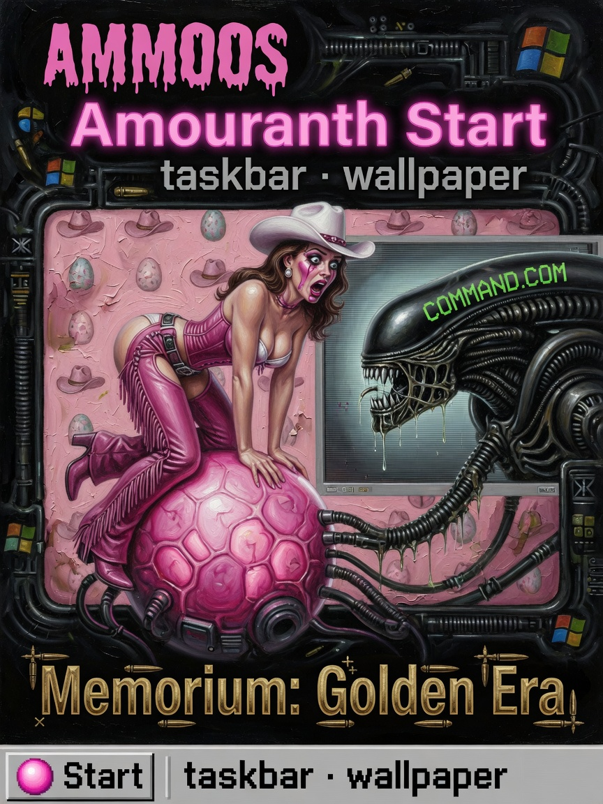
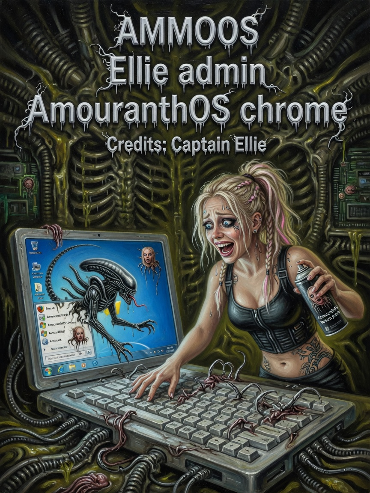
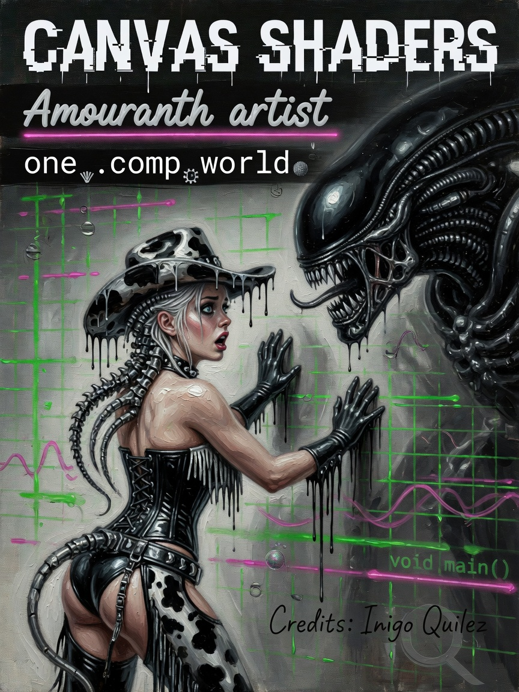

# AmmoOS — Issues 46–48

> *In memoriam: **The Golden Era** — MS-DOS desktop religion, reborn as GPU chrome on guest RAM.*

  
  
  

| Cover | Issue | Cast | Packs |
|-------|-------|------|-------|
| Start menu | **46** | Ammo · sexy Start | FieldAmouranthOs boot |
| Desktop admin | **47** | Ellie · cute admin | textures · gating |
| DOS fan scared | **48** | COMMAND.COM panic | RTX-DOS 7.0 |

---

## The Legend

**AmouranthOS** is not a second kernel. It is **chrome** — taskbar, wallpaper, Start menu, RTX font SDF — layered over guest VGA and GPU textures while the Field Die runs underneath. Issue 46: Ammo at Start like a magazine cover. Issue 47: Ellie administering the desktop because someone must grep the texture sync. Issue 48: the DOS fan meeting RTX-DOS 7.0 with the face from Issue 10.

*Desktop bit in `data_bus[42]`. Shell vs chrome is bus truth.*

---

## The Interview

Boot gospel: `FieldAmouranthOs::boot()` → `sync_aos_textures()` → `patchX86ChromeDescriptors()` → `seedChromeRam`.

Bindings 11–14: ammo portrait, wallpaper, icons, RTX font SDF. Generated by `scripts/gen_rtx_sdf_font.py` if `rtx_font_sdf.png` missing.

Emulators only tick when `emuAdvancesFrames(AppId)` allows — **desktop is not a free-for-all tick storm**.

`data_bus[42]`: bit 12 desktop, bit 29 console shell.

Shutdown: `FieldAmouranthShutdown::closeAllGuestApps`. Exit confirm overlay via `FieldAmouranthExitConfirm`.

Sexy on Issue 46. Cute admin on Issue 47. Scared fan on Issue 48. All deployed.

---

## Beginner

**AmouranthOS** — taskbar, wallpaper, Start menu. Chrome over guest VGA + GPU textures. Not a separate kernel.

---

## Intermediate

Boot chain and bindings above. Emulator gating via `emuAdvancesFrames`.

---

## Expert

`data_bus[42]` bit semantics. Font generation script. Shutdown and exit confirm overlays.

---

**Next:** [07-Emulators-CHIPS.md](07-Emulators-CHIPS.md)

**AMOURANTH FOREVER** — branding loud; physics with units.