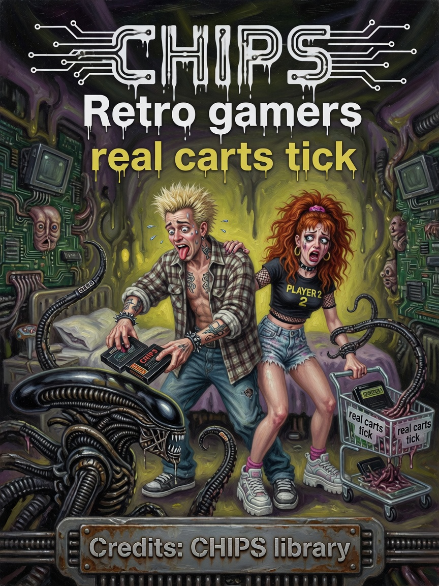
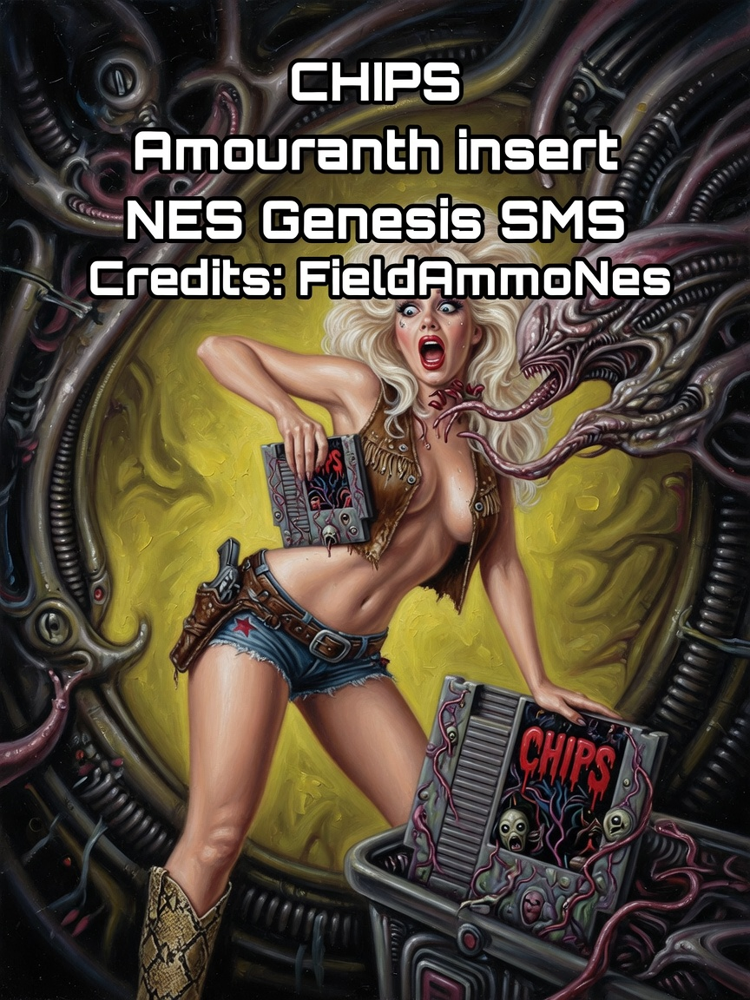
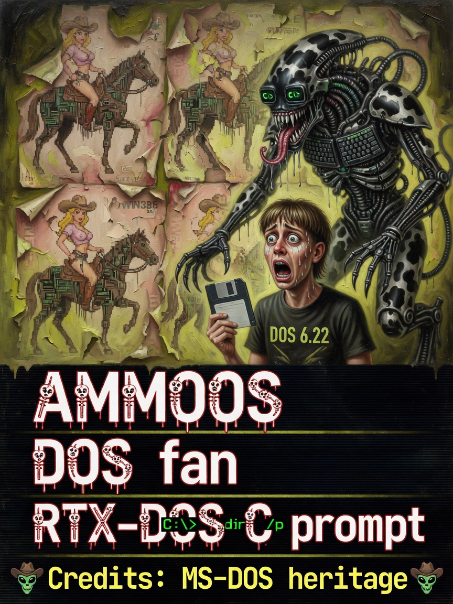

# CHIPS & Emulators — Issues 49–51

> *In memoriam: **CHIPS silicon headers** — 75 files, zero DLL archaeology, carts that tick when Start says go.*

<p align="center">
  
  
  
</p>

| Cover | Issue | Cast | Packs |
|-------|-------|------|-------|
| Cart gamers | **49** | Retro crew | NES/SNES/Genesis |
| 6502 professor | **50** | Sober silicon | 75 headers |
| Cartridge insert | **51** | Ammo | FieldAmmo paths |

---

## The Legend

Issue 49 is the gamer frenzy cover — Issue 3 banana energy but the lure is **cartridges**. Issue 50 is the professor with 6502 clarity. Issue 51 is Ammo inserting proof that guest RAM framebuffer truth works from Start menu to die.

*Header-only religion under `Navigator/engine/CHIPS/`. No dynamic loader cosplay.*

---

## The Interview

Integrated: NES, SNES, Genesis, SMS, Atari 2600. Pattern in `Pipeline::dispatch_canvas`:

```
if active && emuAdvancesFrames(AppId):
    tick(gr, keys)
    audio pump()
```

NES **thermo governor** couples burst to field budget — honest sweat.

`FieldAmmoExec` / Doom: separate GPU exec path. FreeDoom / DOOMBOOT heritage in memoriums.

Add a system: `CHIPS/MySystem/` → `FieldAmmoMySystem.hpp` → `AppId` → dispatch hook → bus packer. Guest RAM = framebuffer truth.

Ammo on Issue 51 proves insert path. Professor on Issue 50 keeps silicon sober. Gamers on Issue 49 keep it fun.

---

## Beginner

Integrated NES, SNES, Genesis, SMS, Atari 2600 — header-only silicon in `CHIPS/`. Carts tick when you launch from Start.

---

## Intermediate

Dispatch tick pattern above. NES thermo governor. `FieldAmmoExec` Doom path.

---

## Expert

Add-system recipe. 75 CHIPS headers. Audio via SDL3_mixer; DOS via `FieldDevices::pumpAudio`.

---

**Next:** [08-Canvas-Shaders.md](08-Canvas-Shaders.md)

**AMOURANTH FOREVER** — branding loud; physics with units.