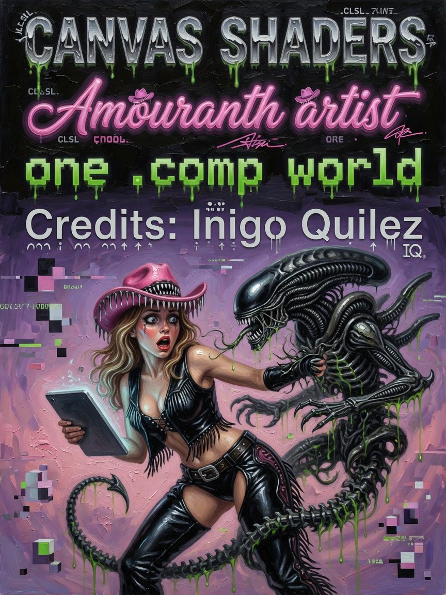
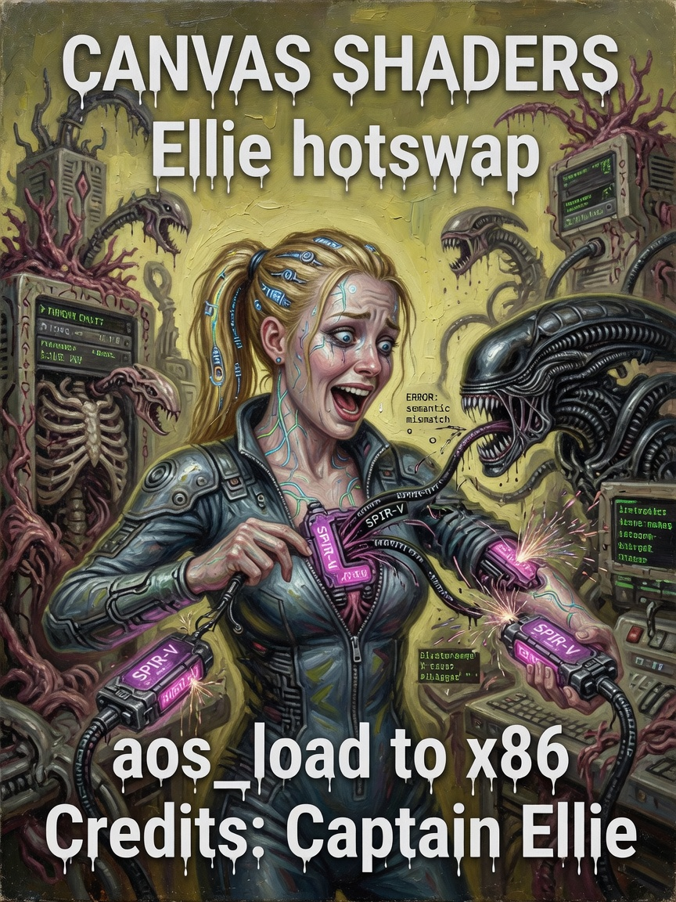
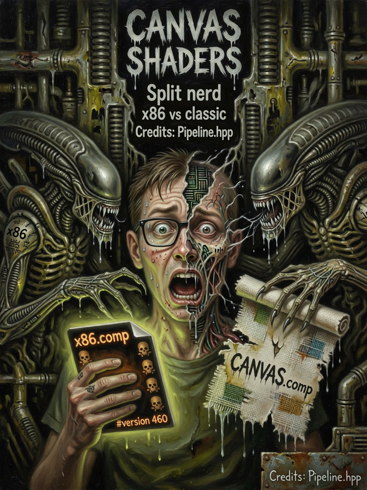

# Canvas Shaders — Issues 52–54

> *In memoriam: **Inigo Quilez** — SDF raymarching canon; the classic path still walks his steps.*

  
  
  

| Cover | Issue | Cast | Packs |
|-------|-------|------|-------|
| Shader artist | **52** | Ammo | x86 default · classic swipe |
| Hotswap Ellie | **53** | Captain Ellie | aos_load → x86 |
| Split nerd | **54** | Scared split | two layouts one fabric |

---

## The Legend

Issue 52: Ammo the shader artist — emblem proof on classic `CANVAS.comp`, Field Die default on index 0. Issue 53: Ellie watching hotswap like a launch director — cute, not helpless. Issue 54: the nerd realizing **two canvas kinds share fabric and accountant** — Steve Ditko anxiety angles.

*Default index 0 = `x86`. Index 1+ = classic SDF worlds. Swipe in Options. Both holy.*

---

## The Interview

Swipe canvases in Options. SPIR-V under `assets/shaders/compute/`. Boot loads `aos_load` → background hotswap → live `x86`. Cache at `assets/cache/vulkan_compute.cache`.

| Index | Name | Kind |
|-------|------|------|
| 0 | x86 | Field Die |
| 1+ | Amouranth, energy, … | Classic |

Layouts: `field_descriptor_layout` vs `pipeline_layout`. `active_pipeline_layout()` selects by `currentCanvasKind`.

`CanvasUsesX86Die = true` remaps name `CANVAS` to x86 die shader. Theme canvases `CANVAS_*` = x86 styling variants (`IsThemeCanvas`).

Sexy classic path. Cute hotswap watch. Scared layout nerd. All one engine.

---

## Beginner

Swipe canvases in Options. Default index 0 = `x86`. Index 1+ = classic SDF worlds.

---

## Intermediate

Index table. `aos_load` boot → hotswap → `x86`. SPIR-V paths.

---

## Expert

Descriptor layouts. `CanvasUsesX86Die` remap. Theme canvas variants.

---

**Next:** [03-Field-Fabric.md](03-Field-Fabric.md)

**AMOURANTH FOREVER** — branding loud; physics with units.