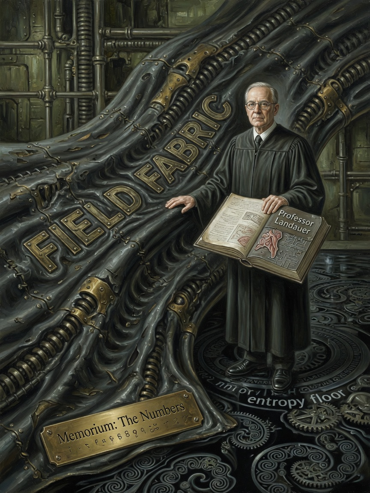

# Thermo Accountant — Issues 58–60

> *In memoriam: **The Numbers** — entropy production in the log, not the pitch deck.*

<p align="center">
  
  
  
</p>

| Cover | Issue | Cast | Packs |
|-------|-------|------|-------|
| Entropy sober | **58** | Professor | receipt printer |
| Captain telemetry | **59** | Ellie · THERMO_PINK | bus mirror 24–28 |
| Maint cost scared | **60** | Ops panic | F4 honesty |

---

## The Legend

The thermo accountant is the brain's **receipt printer**. Every dispatch writes entropy, boundary activity, maintenance cost, free-energy income to a buffer Captain Ellie reads at 3 AM. Issue 58: professor sober — Landauer would nod, then ask for the log file. Issue 59: Ellie cute in THERMO_PINK. Issue 60: ops scared when F4 turns maintenance cost **honest**.

*Issue 20 chains energy from memes archive — everyone is acquaintance, entropy binds.*

---

## The Interview

| Field | Meaning |
|-------|---------|
| entropyThisFrame | Irreversibility this frame |
| prevMaintCost | Price of accumulation (F4) |
| freeEnergyIncome | Input + world influx |
| avgBoundaryThermo | Boundary activity |

F4 on → maint cost rises. **That is the feature.**

Landauer metaphor for `prevMaintCost`. x86 adds `hostHeat` from `FieldX86Emu::hostCyclesLastFrame()`.

Mirrored to `data_bus[24..28]`. Phase 1 schematic — not joule-accurate FEM. Honest numbers where hardware demands.

```bash
grep -E 'entropy|Boundary|THERMO|maint' run.log
```

Professor correct. Ellie cute on grep. Ops scared on F4. Dave Perry would call this "the engine that receipts."

---

## Beginner

Every dispatch writes entropy, boundary activity, maintenance cost, free-energy income to a small buffer you can grep in logs.

---

## Intermediate

Field table above. F4 maintenance honesty. Bus mirror slots 24–28.

---

## Expert

Landauer metaphor. `hostHeat` from host cycles. Phase 1 schematic disclaimer.

---

**Next:** [10-Observability.md](10-Observability.md)

**AMOURANTH FOREVER** — branding loud; physics with units.