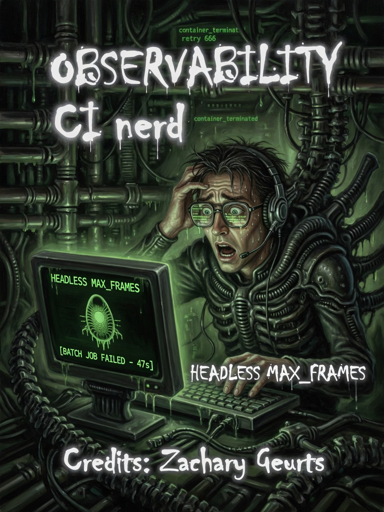
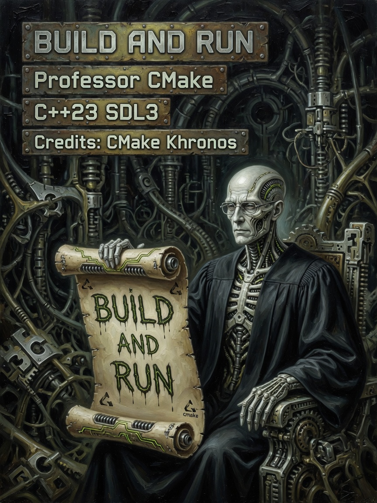
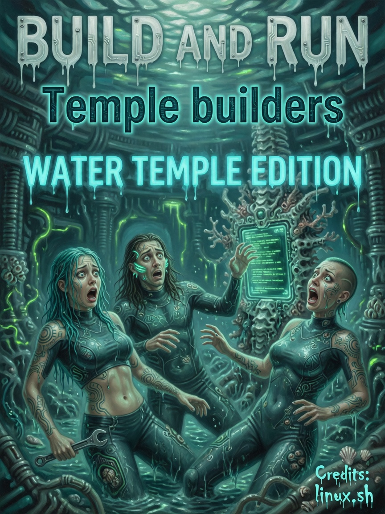

# Build & Run — Issues 64–66

> *In memoriam: **The Tide Temple** — every `./linux.sh` banner, every Water Temple edition binary that ships.*

<p align="center">
  
  
  
</p>

| Cover | Issue | Cast | Packs |
|-------|-------|------|-------|
| Water Temple | **64** | Temple builders | CMake · C++23 · SDL3 |
| linux.sh Ammo | **65** | Ammo runs ritual | build/bin path |
| CMake professor | **66** | Sober ship | cache · dos · CI |

---

## The Legend

Issue 64 is the Tide Temple — aqua builders, CMake gospel, the banner you see when the build succeeds. Issue 65: Ammo pointing at `./linux.sh` like it is a cover exclusive. Issue 66: professor with CMake sobriety — binaries ship, demos in `demos/` if you skip compile.

*Issue 20 reaper chains from memes — build honesty binds.*

---

## The Interview

```bash
./linux.sh           # build
./linux.sh run       # launch
./linux.sh dos       # RTX-DOS image
./linux.sh --help
```

Binary: `build/bin/Linux/AMOURANTHRTX`. Demos in `demos/` if you skip compile.

Assets: `assets/shaders/compute/*.spv`, `assets/dos/rtx_dos_hd.img`, `assets/cache/vulkan_compute.cache`.

| Failure | Fix |
|---------|-----|
| No spv | Re-run linux.sh |
| RTX-DOS warn | ./linux.sh dos |
| Black HUD | Clean rebuild, check layout version |

CMake: C++23, Vulkan, SDL3_image/mixer, optional LTO release.

CI template in repo; grep `STATUS` gate. Pipeline cache skipped if hotswap still running at exit.

Windows: `windows.ps1` mirrors targets.

Temple builders on 64. Ammo sexy on script. Professor sober on CMake. Ship it.

---

## Beginner

`./linux.sh` build · `./linux.sh run` launch · `./linux.sh dos` for RTX-DOS image.

---

## Intermediate

Asset paths and failure table above.

---

## Expert

CMake flags. CI grep gate. Windows script parity. Pipeline cache exit behavior.

---

**Next:** [Home.md](Home.md) · **Full circle.**

**AMOURANTH FOREVER** — branding loud; physics with units.