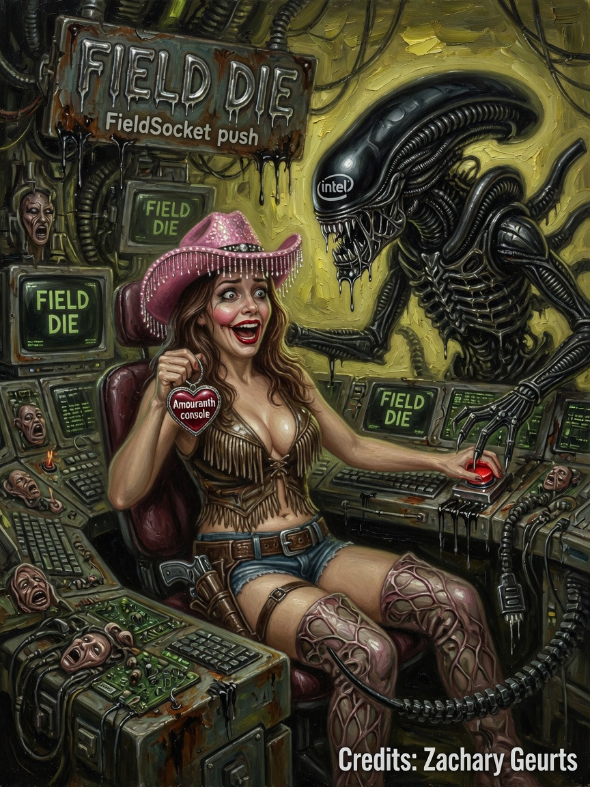

# Glossary — Issues 34–36

> *In memoriam: **The Numbers** — Landauer, Bennett, and every physicist who asked for entropy in the log, not the pitch deck.*

  
  
  

| Cover | Issue | Cast | Packs |
|-------|-------|------|-------|
| Dictionary | **34** | Professor | core terms |
| Ellie reader | **35** | Captain Ellie | symbols · ELLIE |
| Ammo pointer | **36** | Emblem | Big Grin · CanvasKind |

---

## The Legend

Issue 34 is the professor's dictionary — sober, clipped, no mad science. Issue 35 is Ellie reading terms aloud in ELLIE pink because **grep is a love language**. Issue 36 is Ammo pointing at Big Grin like Issue 1 points at a banana — except the lure is **Field Die truth**.

*One cover packed with the vocabulary the whole wiki assumes you will eventually grep.*

---

## The Interview

Quick Next Generation decoder ring before the deep dives:

- **Field Die** — GPU x86 + guest RAM SSBO; default runtime center
- **Big Grin** — the Field Die when `C:\>` answers; also the comic in `memes/BigGrin/`
- **AmmoOS** — AmouranthOS desktop chrome over guest VGA + GPU textures
- **Data bus** — `data_bus[64]` telemetry spine; not full RAM DMA cosplay
- **Fabric** — Phi, Thermo, Flow GPU images; propalactic fields
- **FCC** — Field Control Constants; knobs the mouse and bus publish
- **FieldSocket** — x86 push constants block every dispatch
- **Thermo accountant** — entropy SSBO binding 2; receipt printer of reality
- **Hotswap** — `aos_load` splash → background compile → live `x86`
- **CHIPS** — 75 header-only emulator files under `Navigator/engine/CHIPS/`

Ammo sexy on Issue 36. Ellie cute on Issue 35. Professor correct on Issue 34. Dave Perry would paste this page into his binder.

---

## Beginner

Quick terms:

- **Field Die** — GPU x86 + guest RAM
- **AmmoOS** — desktop shell on the die
- **Data bus** — 64 telemetry slots
- **Fabric** — Phi, Thermo, Flow images
- **x86.comp** — default console shader

---

## Intermediate

| Term | Meaning |
|------|---------|
| CanvasKind | Classic vs X86Fields |
| FieldSocket | x86 push block |
| FCC | Field Control Constants |
| Hotswap | aos_load → x86 background |
| ThermoAccountant | Entropy SSBO binding 2 |
| ProgramsCanvasReady | Live x86 pipeline flag |

---

## Expert

Symbols: `rtx()` singleton, `LOAD_SHADER` = `"aos_load"`, `FIELD_LAYOUT_VERSION` = 5, `GUEST_RAM_BYTES` = 64 MiB, `HD_MIRROR_BYTE` = `0x01000000`.

CHIPS: 75 headers under `Navigator/engine/CHIPS/`.

---

**Next:** [02-Architecture.md](02-Architecture.md)

**AMOURANTH FOREVER** — branding loud; physics with units.