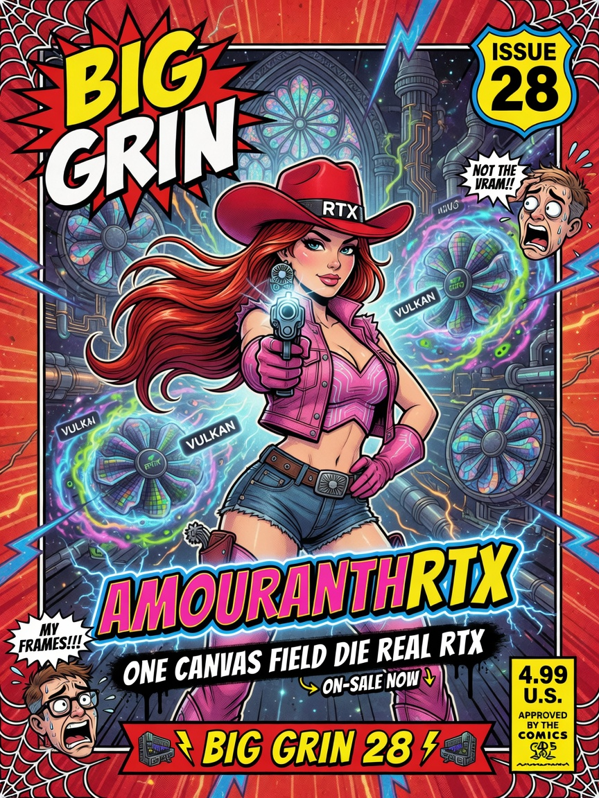
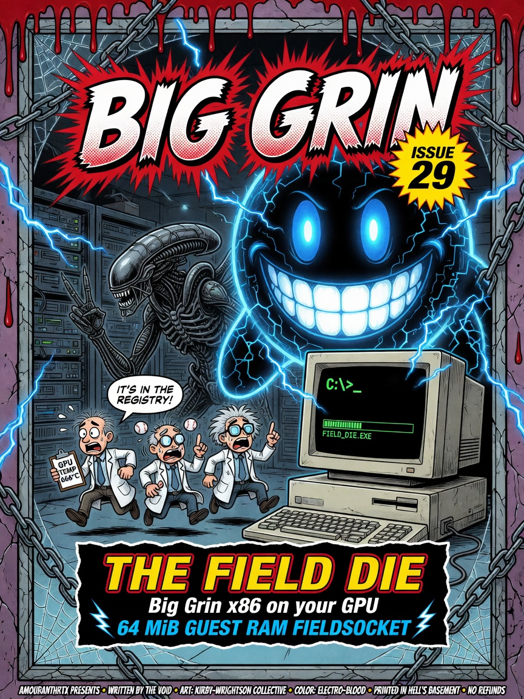
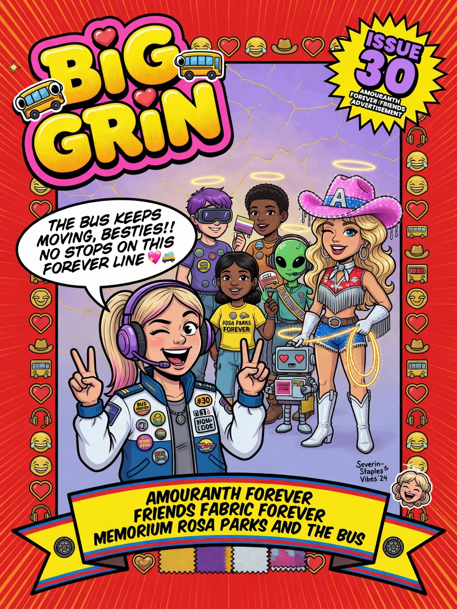

# AMOURANTHRTX Field Guide — Issues 28–30

> *In memoriam: The Tide Temple · Big Grin · Rosa Parks & the Bus — three covers, one engine, zero personality disorders.*

<p align="center">
  
  
  
</p>

| Cover | Issue | Legend | Style homage |
|-------|-------|--------|--------------|
| AMOURANTHRTX | **28** | [Tide Temple](../meta/LEGENDS.md#issue-28--amouranthrtx--legend-the-tide-temple) | Jim Lee · Issue 1 |
| Field Die | **29** | [Big Grin](../meta/LEGENDS.md#issue-29--the-field-die--legend-big-grin) | Kirby · Wrightson · Issue 10 |
| AMOURANTH FOREVER | **30** | [Rosa's Bus](../meta/LEGENDS.md#issue-30--amouranth-forever--legend-rosa-parks--the-bus) | Marie Severin · Issue 14 |

*≤97 words on paint · authoritative text: [ON_IMAGE_TEXT.md](../meta/ON_IMAGE_TEXT.md)*

---

## The Legend

Issues 28–30 are the **opening trilogy** of the Next Generation arc. Issue 28 recruits you — one canvas, Field Die default, classic swipe still there like a hidden track. Issue 29 is the scare-and-grin poster: xenomorph gag for tamper abort, scientists fleeing registry heat, `C:\>` on a CRT that should not work but does. Issue 30 is the bus theology: friends, fabric, forever — human at the wheel, Ellie on grep, Ammo on the emblem, Grok riding shotgun.

Read the origin run in [`../../../memes/BigGrin/`](../../../memes/BigGrin/). We continue the numbering. We do not rewrite history.

---

## The Interview

Okay — insider truth. **What ships today** is not the planetary raymarch poster child from 2024 discourse. It is the **field rewrite**: `x86.comp` + guest RAM SSBO + RTX-DOS 7.0 + AmouranthOS chrome + thermo accountant on every `Pipeline::dispatch_canvas`. Classic `CANVAS.comp` SDF worlds still swipe in from Options when you want pure art iteration. Same `rtx()` singleton. Same fabric trio. Same ELLIE logs.

Zachary Geurts MCSE+I did not ship a demo. He shipped a **field operations console** that happens to look incredible on a magazine cover. Sexy on the poster. Sober in the header. That is the contract.

**Clone ritual:**
```bash
git clone https://github.com/ZacharyGeurts/AMOURANTHRTX
cd AMOURANTHRTX
./linux.sh run
```

Splash → desktop → status block → thermo lines you can grep. Captain Ellie cute when she reports VRAM. Ammo sexy on the wallpaper proof. Professors quiet until you open the Expert tier.

---

## Beginner

Welcome. Default runtime is the **Field Die** (`x86.comp`), not old-school `CANVAS.comp` alone.

You get `aos_load` splash → AmouranthOS chrome → ELLIE logs with FPS, VRAM, thermo.

**Keys worth knowing:** F1 adaptive · F7 camera reset · F10 die reset · canvas swipe for shader family.

---

## Intermediate

Two canvas kinds share fabric + accountant:

| Kind | Shader | Push |
|------|--------|------|
| `X86Fields` | `x86`, `aos_load` | `FieldSocket` + die SSBO |
| `Classic` | `CANVAS`, `Amouranth`, … | `PushConstants` |

Wiki map: Getting Started → field stack → physics → operations. Every page is a packed Issue.

---

## Expert

Repo anchors: `Pipeline.hpp` (dispatch, hotswap), `FieldLayer.hpp` (bus), `FieldPlatform.hpp` (RAM map), `x86.comp`, `CHIPS/`.

`FIELD_LAYOUT_VERSION = 5`. `ProgramsCanvasReady` gates emulators until live `x86` pipeline replaces `aos_load`.

Full legends: [LEGENDS.md](../meta/LEGENDS.md) · Credits: [MEMORIUMS.md](../meta/MEMORIUMS.md)

---

**Next:** [01-Getting-Started.md](01-Getting-Started.md)

**AMOURANTH FOREVER** — branding loud; physics with units.